## mininet 指令

### 用mininet實作traffic control(流量控制)
mininet是用軟體模擬呈現流量控制
* 預設參數(若無另外修改參數，即為如此)
    ```
    mn --link=tc,bw=10,delay='1ms',loss=0
    ```

* 修改參數
    1. 修改參數成下圖
    
        ```
        mn --link=tc,bw=100,delay='10ms',loss=1
        ```

    2. h1 ping h2 測試
        ```
        mininet> h1 ping -c 1000 -i 0.01 h2
        ```
        > * `-c 1000` 發送1000個封包

        > * `-i 0.01` 每0.01sec發送一個封包，換句話說為100個/sec( = 0.01 * 1000)
        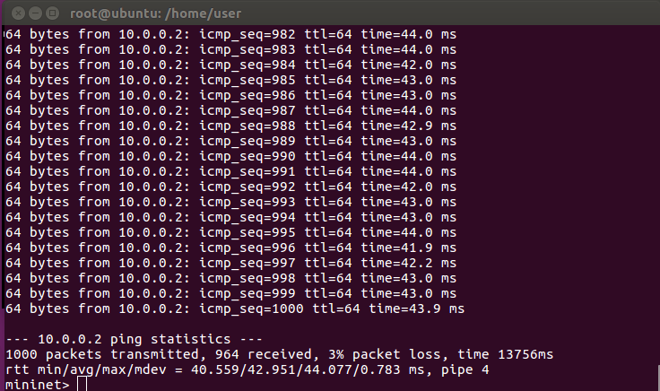
        
        **由實驗數據可以得知因為以下幾點**
        * loss rate = 3 ~ 4% ，其原因是 1 - 0.99*0.99*0.99*0.99 ≒ 3~4%
        * 封包傳送時間為 `4X ms` 其原因是 因為ping 是雙向的，且h1->s1 delay=10ms，s1->h2 delay=10ms，所以是10m/s*4 = 40ms，但往往數值都不會是剛好40ms的原因是封包進到每一個節點都要做處理，所以才會是`4X ms`
        
    3. 開啟node h1 h2 分別以tcp和udp做傳輸並到至特定目標
        ```
        h1> iperf -c 10.0.0.2 -p 5555 -t 100
        h1> iperf -c 10.0.0.2 -p 6666 -t 100 -u -b 3M
        h2> iperf -s -i 1 -p 5555 | tee tcp
        h2> iperf -s -i 1 -p 6666 -u | tee udp
        ```
        > * `tee` 此指令可讓資料導至特定檔案內也可同時讓資料顯示在終端機上

        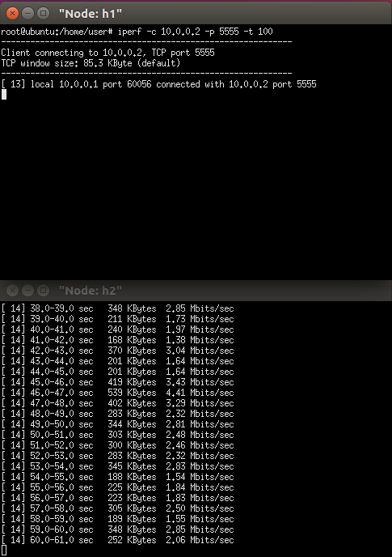

        **由實驗數據可以得知因為以下幾點**
        * 我們會發現tcp跑的速度照理還說會是要全速跑，但數據顯示並沒有這麼做，那我們要開始去懷疑當初我們設定的環境參數 (traffic control)，`因為在loss rate 部份我們是設定1%，而在tcp傳輸方式只要封包在傳送過程中有掉包(loss)就會變慢`。

    4. 修改環境參數
        ```
        mn --link=tc,bw=100,delay='10ms',loss=0
        ```
        

    5. 重跑一次實驗
        ```
        h1> iperf -c 10.0.0.2 -p 5555 -t 100
        h1> iperf -c 10.0.0.2 -p 6666 -t 100 -u -b 3M
        h2> iperf -s -i 1 -p 5555 | tee tcp
        h2> iperf -s -i 1 -p 6666 -u | tee udp
        ```
        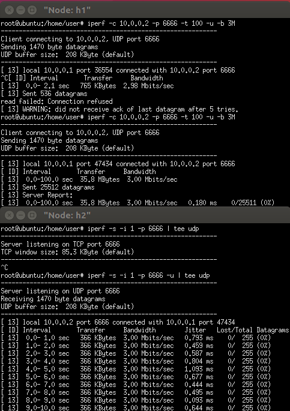
        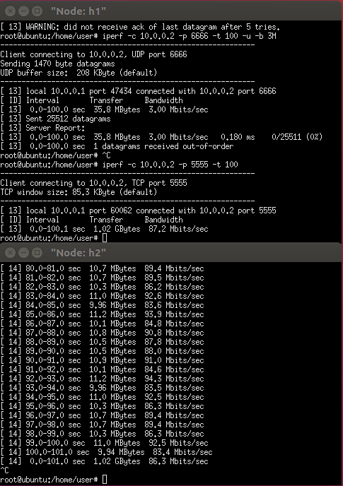

        **由實驗數據可以得知因為以下幾點**
        * 這時候的實驗數據就非常正常了，滿接近我們當初設定的參數(`tcp發送一次成功的話會回來2個ack`，所以如果都沒有loss的話速度會呈現`指數型成長`，但如果失敗速度就會降下來)

    6. 資料前處理
    顯示tcp數據儲存至mytcp
    ```
    cat tcp | grep sec | head -n 100 | tr "-" " " | awk '{print $4,$8}' > mytcp
    ```
    顯示udp數據並儲存至myudp
    ```
    cat udp | grep sec | head -n 100 | tr "-" " " | awk '{print $4,$8}' > myudp
    ```

    7. 開啟gnuplot並將剛剛經處理的數據圖表化
    ```
    gnuplot> plot "mytcp" title "tcp-flow" with linespoints, "myudp" title "udp-flow" with linespoints
    gnuplot> set xlabel "time (sec)"
    gnuplot> set ylabel "throughtput (Mbps)"
    gnuplot> set title "tcp vs udp"
    gnuplot> set terminal gif
    gnuplot> set output "a.gif"
    ```
    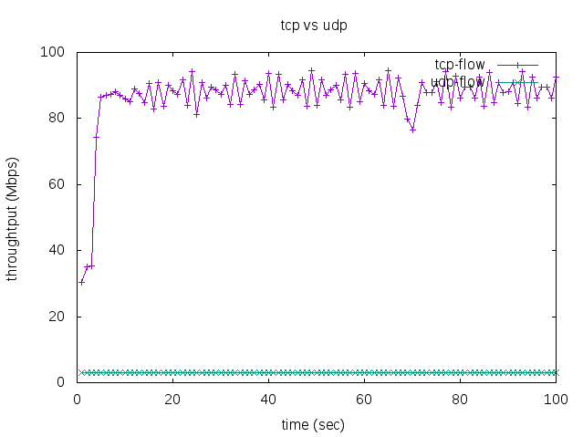

### 當mininet遇上python
* 用python 建置簡易mininet環境

    1. python code(example code/1.py)
        ```
        from mininet.cli import CLI
        from mininet.net import Mininet
        from mininet.link import Link,TCLink

        if '__main__' == __name__:
            net = Mininet(link=TCLink)
            h1 = net.addHost('h1')
            h2 = net.addHost('h2')
            Link(h1, h2)
            net.build()
            CLI(net)
            net.stop()
        ```

    2. 執行
    ```
    python 1.py
    ``` 
    3. 顯示現在節點
    ```
    mininet> net
    ```
    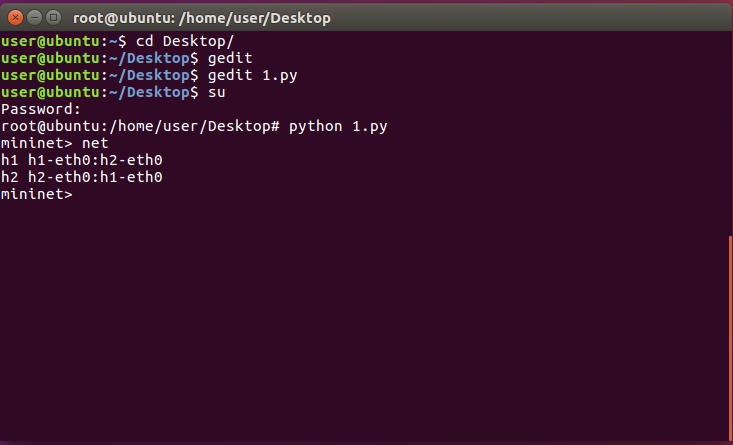

* 建置2 host 1 router node分屬不同區域網路通訊

    
    
    1. 建立節點 python code (example code/2.py)
        ```
        from mininet.cli import CLI
        from mininet.net import Mininet
        from mininet.link import Link,TCLink

        if '__main__' == __name__:
            net = Mininet(link=TCLink)
            h1 = net.addHost('h1')
            h2 = net.addHost('h2')
            r = net.addHost('r')
            Link(h1, r)
            Link(h2, r)
            net.build()
            CLI(net)
            # mininet>
            net.stop()
        ```

    2. 執行 
        ```
        mininet> python 2.py
        ```
        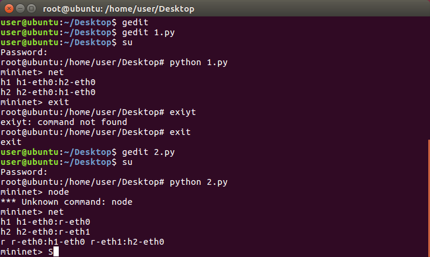

    3. 清除h1 h2 網路卡設定
        ```
        h1> ifconfig h1-eth0 0
        h2> ifconfig h2-eth0 0
        ```

    4. 修改h1 h2網路卡設定
        ```
        h1> ip addr add 192.168.1.1/24 brd + dev h1-eth0
        h2> ip addr add 192.168.1.2/24 brd + dev h2-eth0
        ```

    5. 設定內定路由(default route)
        ```
        h1> ip route show
        h1> ip route add default via 192.168.1.254
        h2> ip route add default via 192.168.2.254
        r> ip addr add 192.168.1.254/24 brd + dev r-eth0
        r> ip addr add 192.168.2.254/24 brd + dev r-eth1
        r> cat /proc/sys/net/ipv4/ip_forward
        r> echo 1 > /proc/sys/net/ipv4/ip_forward
        ```
        > * `cat /proc/sys/net/ipv4/ip_forward` 如果0的話是關閉路由功能，如果為1則為開啟

    6. ping 

        成功
        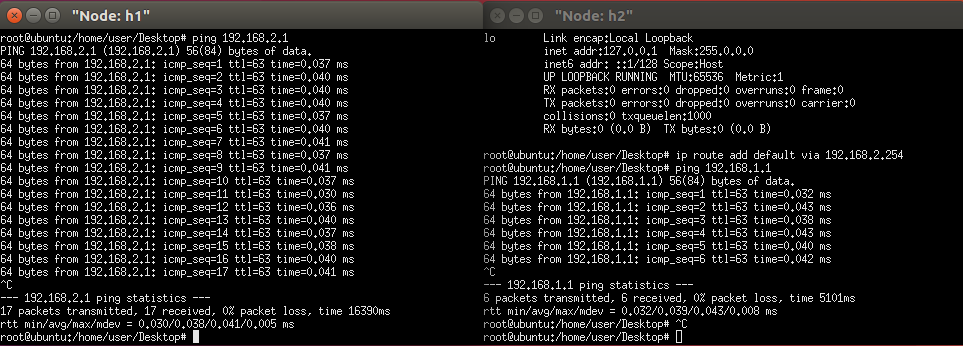
* 以python code 建置2 host 2 router node分屬不同區域網路通訊

    1. 建立節點 python code (example code/3.py)
        ```
        from mininet.cli import CLI
        from mininet.net import Mininet
        from mininet.link import Link,TCLink
 
        if '__main__' == __name__:
            net = Mininet(link=TCLink)
            h1 = net.addHost('h1')
            h2 = net.addHost('h2')
            r = net.addHost('r')
            Link(h1, r)
            Link(h2, r)
            net.build()
            h1.cmd("ifconfig h1-eth0 0")
            h1.cmd("ip addr add 192.168.1.1/24 brd + dev h1-eth0")
            h1.cmd("ip route add default via 192.168.1.254")
            h2.cmd("ifconfig h2-eth0 0")
            h2.cmd("ip addr add 192.168.2.1/24 brd + dev h2-eth0")
            h2.cmd("ip route add default via 192.168.2.254")
            r.cmd("ifconfig r-eth0 0")
            r.cmd("ifconfig r-eth1 0")
            r.cmd("ip addr add 192.168.1.254/24 brd + dev r-eth0")
            r.cmd("ip addr add 192.168.2.254/24 brd + dev r-eth1")
            r.cmd("echo 1 > /proc/sys/net/ipv4/ip_forward")
            CLI(net)
            net.stop()
        ```
    
    2. 執行
        ```
        python 3.py
        ```

    3. ping
        ```
        mininet> h1 ping h2
        ```
        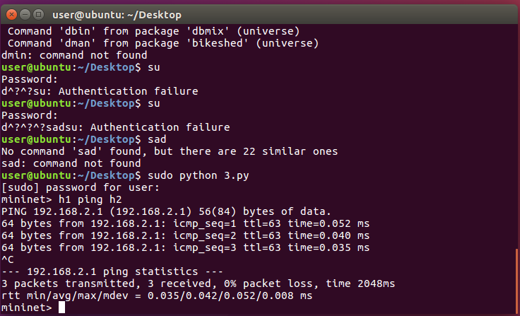

* 建置2 host 2 router node分屬不同區域網路通訊

    

    1. 建立節點 python code (example code/4.py)
        ```py
        from mininet.cli import CLI
        from mininet.net import Mininet
        from mininet.link import Link,TCLink
 
        if '__main__' == __name__:
            net = Mininet(link=TCLink)
            h1 = net.addHost('h1')
            h2 = net.addHost('h2')
            r1 = net.addHost('r1')
            r2 = net.addHost('r2')
            Link(h1, r1)
            Link(h2, r2)
            Link(r1, r2)
            net.build()
            h1.cmd("ifconfig h1-eth0 0")
            h1.cmd("ip addr add 192.168.1.1/24 brd + dev h1-eth0")
            h1.cmd("ip route add default via 192.168.1.254")

            h2.cmd("ifconfig h2-eth0 0")
            h2.cmd("ip addr add 192.168.2.1/24 brd + dev h2-eth0")
            h2.cmd("ip route add default via 192.168.2.254")

            r1.cmd("ifconfig r1-eth0 0")
            r1.cmd("ifconfig r1-eth1 0")
            r1.cmd("ip addr add 192.168.1.254/24 brd + dev r1-eth0")#catch
            r1.cmd("ip addr add 192.168.87.1/24 brd + dev r1-eth1")
            r1.cmd("echo 1 > /proc/sys/net/ipv4/ip_forward")#open routing
            r1.cmd("ip route add 192.168.2.0/24 via 192.168.87.2")

            r2.cmd("ifconfig r2-eth0 0")
            r2.cmd("ifconfig r2-eth1 0")
            r2.cmd("ip addr add 192.168.2.254/24 brd + dev r2-eth0")#catch
            r2.cmd("ip addr add 192.168.87.2/24 brd + dev r2-eth1")
            r2.cmd("echo 1 > /proc/sys/net/ipv4/ip_forward")#open routing
            r2.cmd("ip route add 192.168.1.0/24 via 192.168.87.1")

            CLI(net)
            net.stop()
        ```
    
    2. 執行
        ```
        python 4.py
        ```

    3. ping
        ```
        mininet> h1 ping h2
        ```
        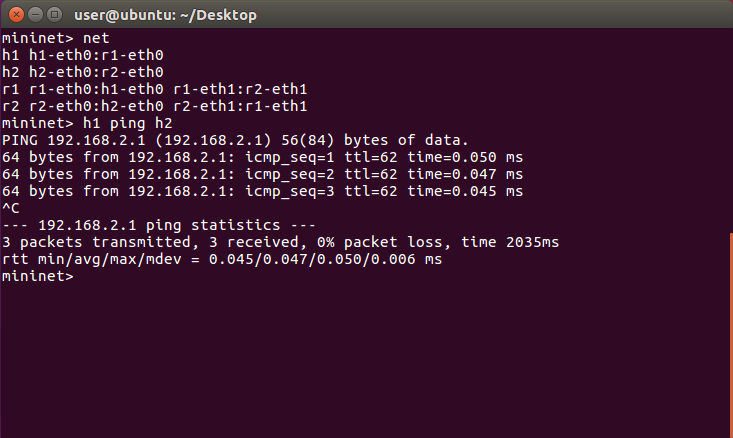
        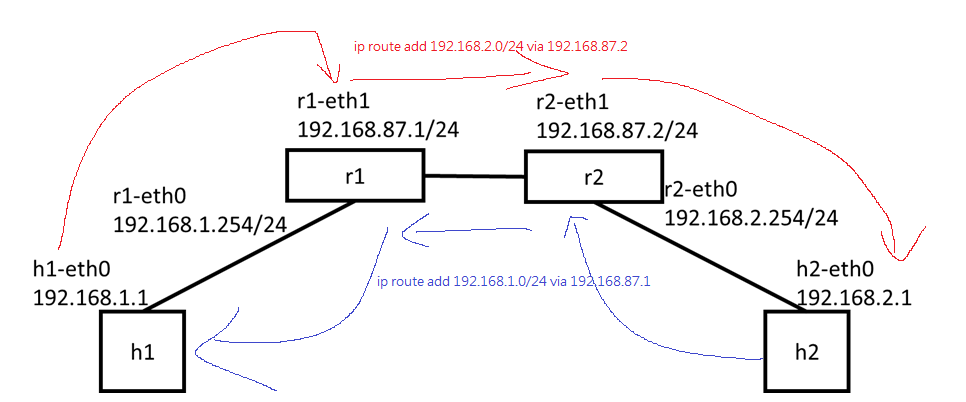
