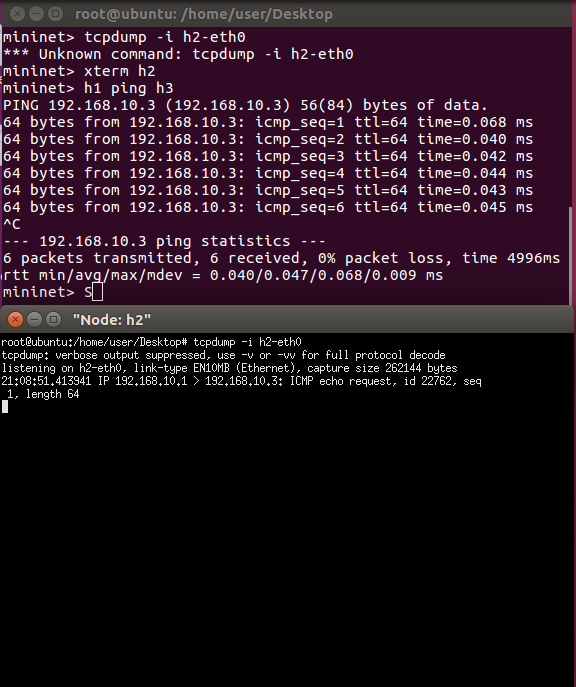

## mininet指令

### 當mininet遇上python

* 在2 node 2 router 將區網(private network)內的封包傳送至外網(public network)

    

    1. 將內網的封包轉至外網需要用到NAT(網路位址轉換，Network Address Translation)技術
    2. python code (example code/5.py)
        ```py
        from mininet.cli import CLI
        from mininet.net import Mininet
        from mininet.link import Link,TCLink
 
        if '__main__' == __name__:
            net = Mininet(link=TCLink)
            h1 = net.addHost('h1')
            h2 = net.addHost('h2')
            r1 = net.addHost('r1')
            r2 = net.addHost('r2')
            Link(h1, r1)
            Link(h2, r2)
            Link(r1, r2)
            net.build()
            h1.cmd("ifconfig h1-eth0 0")
            h1.cmd("ip addr add 192.168.1.1/24 brd + dev h1-eth0")
            h1.cmd("ip route add default via 192.168.1.254")
            h2.cmd("ifconfig h2-eth0 0")
            h2.cmd("ip addr add 22.1.1.1/24 brd + dev h2-eth0")
            h2.cmd("ip route add default via 22.1.1.254")
            r1.cmd("ifconfig r1-eth0 0")
            r1.cmd("ifconfig r1-eth1 0")
            r1.cmd("ip addr add 192.168.1.254/24 brd + dev r1-eth0")
            r1.cmd("ip addr add 12.1.1.1/24 brd + dev r1-eth1")
            r1.cmd("ip route add default via 12.1.1.2")
            r1.cmd("echo 1 > /proc/sys/net/ipv4/ip_forward")
            r1.cmd("iptables -t nat -A POSTROUTING -o r1-eth1 -s 192.168.1.0/24 -j MASQUERADE")
            r2.cmd("ifconfig r2-eth0 0")
            r2.cmd("ifconfig r2-eth1 0")
            r2.cmd("ip addr add 22.1.1.254/24 brd + dev r2-eth0")
            r2.cmd("ip addr add 12.1.1.2/24 brd + dev r2-eth1")
            r2.cmd("echo 1 > /proc/sys/net/ipv4/ip_forward")
            CLI(net)
            net.stop()
        ```
    3. 看wireshark在r1-eth0與r1-eth1裡有什麼差別
    

* 3 nodes 1 bridge

    
    1. python code (example code/bridge1.py)
        ```py
        from mininet.cli import CLI
        from mininet.net import Mininet
        from mininet.link import Link,TCLink,Intf

        if '__main__' == __name__:
            net = Mininet(link=TCLink)
            h1 = net.addHost('h1')
            h2 = net.addHost('h2')
            h3 = net.addHost('h3')
            br1 = net.addHost('br1')
            net.addLink(h1, br1)
            net.addLink(h2, br1)
            net.addLink(h3, br1)
            net.build()
            h1.cmd("ifconfig h1-eth0 0")
            h2.cmd("ifconfig h2-eth0 0")
            h3.cmd("ifconfig h3-eth0 0")
            br1.cmd("ifconfig br1-eth0 0")
            br1.cmd("ifconfig br1-eth1 0")
            br1.cmd("ifconfig br1-eth2 0")

            br1.cmd("brctl addbr mybr")
            br1.cmd("brctl addif mybr br1-eth0")
            br1.cmd("brctl addif mybr br1-eth1")
            br1.cmd("brctl addif mybr br1-eth2")
            br1.cmd("ifconfig mybr1 up")
            br1.cmd("ifconfig mybr2 up")
            h1.cmd("ip address add 192.168.10.1/24 dev h1-eth0")
            h2.cmd("ip address add 192.168.10.2/24 dev h2-eth0")
            h3.cmd("ip address add 192.168.10.3/24 dev h3-eth0")
            CLI(net)
            net.stop() 
        ```
    2. h1 ping h2 & h3
    
    3. 測試h1 ping h3 h2 可不可以監聽的到封包
        ### 監聽通過某網卡的封包
        
            tcpdump -i h2-eth0
    
    當 h1 ping h3，h2 不會監聽到任何的訊息

* 4 nodes 2 bridge

    
    1. 分別把只把h1連在一起h2，只把h3連在一起h4，來看看會有什麼結果。
    2. python code (example code/bridge2.py)
        ```py
        from mininet.cli import CLI
        from mininet.net import Mininet
        from mininet.link import Link,TCLink,Intf

        if '__main__' == __name__:
            net = Mininet(link=TCLink)
            h1 = net.addHost('h1')
            h2 = net.addHost('h2')
            h3 = net.addHost('h3')
            h4 = net.addHost('h4')
            br1 = net.addHost('br1')
            net.addLink(h1, br1)
            net.addLink(h2, br1)
            net.addLink(h3, br1)
            net.addLink(h4, br1)
            net.build()
            h1.cmd("ifconfig h1-eth0 0")
            h2.cmd("ifconfig h2-eth0 0")
            h3.cmd("ifconfig h3-eth0 0")
            h4.cmd("ifconfig h4-eth0 0")
            br1.cmd("ifconfig br1-eth0 0")
            br1.cmd("ifconfig br1-eth1 0")
            br1.cmd("ifconfig br1-eth2 0")
            br1.cmd("ifconfig br1-eth3 0")

            br1.cmd("brctl addbr mybr1")
            br1.cmd("brctl addbr mybr2")
            br1.cmd("brctl addif mybr1 br1-eth0")
            br1.cmd("brctl addif mybr1 br1-eth1")
            br1.cmd("brctl addif mybr2 br1-eth2")
            br1.cmd("brctl addif mybr2 br1-eth3")
            br1.cmd("ifconfig mybr1 up")
            br1.cmd("ifconfig mybr2 up")
            h1.cmd("ip address add 192.168.10.1/24 dev h1-eth0")
            h2.cmd("ip address add 192.168.10.2/24 dev h2-eth0")
            h3.cmd("ip address add 192.168.20.1/24 dev h3-eth0")
            h4.cmd("ip address add 192.168.20.2/24 dev h4-eth0")
            CLI(net)
            net.stop() 
        ```
    
    結果證明這樣的接法只有h1能和h2互ping，h3能和h4互ping

* 4 nodes 2 bridges 1 roulter

    
    1. 分別把h1連在一起h2，h3連在一起h4 ，再把兩個bridge用roulter連起來

    2. python code (example code/bridge3.py)
        ```py
        #! /usr/bin/env python
        from mininet.cli import CLI
        from mininet.net import Mininet
        from mininet.link import Link,TCLink,Intf

        if '__main__' == __name__:
            net = Mininet(link=TCLink)
            h1 = net.addHost('h1')
            h2 = net.addHost('h2')
            h3 = net.addHost('h3')
            h4 = net.addHost('h4')
            br1 = net.addHost('br1')
            r1 = net.addHost('r1')
            net.addLink(h1, br1)
            net.addLink(h2, br1)
            net.addLink(h3, br1)
            net.addLink(h4, br1)
            net.addLink(br1,r1)
            net.addLink(br1,r1)
            net.build()
            h1.cmd("ifconfig h1-eth0 0")
            h2.cmd("ifconfig h2-eth0 0")
            h3.cmd("ifconfig h3-eth0 0")
            h4.cmd("ifconfig h4-eth0 0")
            br1.cmd("ifconfig br1-eth0 0")
            br1.cmd("ifconfig br1-eth1 0")
            br1.cmd("ifconfig br1-eth2 0")
            br1.cmd("ifconfig br1-eth3 0")
            br1.cmd("ifconfig br1-eth4 0")
            br1.cmd("ifconfig br1-eth5 0")

            br1.cmd("brctl addbr mybr1")
            br1.cmd("brctl addbr mybr2")
            br1.cmd("brctl addif mybr1 br1-eth0")
            br1.cmd("brctl addif mybr1 br1-eth1")
            br1.cmd("brctl addif mybr1 br1-eth4")
            br1.cmd("brctl addif mybr2 br1-eth2")
            br1.cmd("brctl addif mybr2 br1-eth3")
            br1.cmd("brctl addif mybr2 br1-eth5")
            br1.cmd("ifconfig mybr1 up")
            br1.cmd("ifconfig mybr2 up")

            r1.cmd('ifconfig r1-eth0 192.168.10.254 netmask 255.255.255.0')
            r1.cmd('ifconfig r1-eth1 192.168.20.254 netmask 255.255.255.0')
            r1.cmd("echo 1 > /proc/sys/net/ipv4/ip_forward")
            h1.cmd("ip address add 192.168.10.1/24 dev h1-eth0")
            h1.cmd("ip route add default via 192.168.10.254")
            h2.cmd("ip address add 192.168.10.2/24 dev h2-eth0")
            h2.cmd("ip route add default via 192.168.10.254")
            h3.cmd("ip address add 192.168.20.1/24 dev h3-eth0")
            h3.cmd("ip route add default via 192.168.20.254")
            h4.cmd("ip address add 192.168.20.2/24 dev h4-eth0")
            h4.cmd("ip route add default via 192.168.20.254")
            CLI(net)
            net.stop() 
        ```
        
        h1、h2、h3、h4都可以互ping 


* 4 nodes 2 bridges 1 roulter vlan

    
    1. asd

    2. python code (example code/bridgeWithVlan.py)
        ``` py
        from mininet.cli import CLI
        from mininet.net import Mininet
        from mininet.link import Link,TCLink,Intf

        if '__main__' == __name__:
            net = Mininet(link=TCLink)
            h1 = net.addHost('h1')
            h2 = net.addHost('h2')
            h3 = net.addHost('h3')
            h4 = net.addHost('h4')
            br1 = net.addHost('br1')
            r1 = net.addHost('r1')
            net.addLink(h1, br1)
            net.addLink(h2, br1)
            net.addLink(h3, br1)
            net.addLink(h4, br1)
            net.addLink(br1,r1)
            net.build()
            h1.cmd("ifconfig h1-eth0 0")
            h2.cmd("ifconfig h2-eth0 0")
            h3.cmd("ifconfig h3-eth0 0")
            h4.cmd("ifconfig h4-eth0 0")
            r1.cmd("ifconfig r1-eth0 0")
            br1.cmd("ifconfig br1-eth0 0")
            br1.cmd("ifconfig br1-eth1 0")
            br1.cmd("ifconfig br1-eth2 0")
            br1.cmd("ifconfig br1-eth3 0")
            br1.cmd("ifconfig br1-eth4 0")

            br1.cmd("vconfig add br1-eth4 10")
            br1.cmd("vconfig add br1-eth4 20")
            r1.cmd("vconfig add r1-eth0 10")
            r1.cmd("vconfig add r1-eth0 20")

            br1.cmd("brctl addbr mybr10")
            br1.cmd("brctl addbr mybr20")
            br1.cmd("brctl addif mybr10 br1-eth0")
            br1.cmd("brctl addif mybr10 br1-eth1")
            br1.cmd("brctl addif mybr10 br1-eth4.10")
            br1.cmd("brctl addif mybr20 br1-eth2")
            br1.cmd("brctl addif mybr20 br1-eth3")
            br1.cmd("brctl addif mybr20 br1-eth4.20")
            br1.cmd("ifconfig br1-eth4.10 up")
            br1.cmd("ifconfig br1-eth4.20 up")
            r1.cmd("ifconfig r1-eth0.10 up")
            r1.cmd("ifconfig r1-eth0.20 up")
            br1.cmd("ifconfig mybr10 up")
            br1.cmd("ifconfig mybr20 up")

            r1.cmd('ifconfig r1-eth0.10 192.168.10.254 netmask 255.255.255.0')
            r1.cmd('ifconfig r1-eth0.20 192.168.20.254 netmask 255.255.255.0')
            r1.cmd("echo 1 > /proc/sys/net/ipv4/ip_forward")
            h1.cmd("ip address add 192.168.10.1/24 dev h1-eth0")
            h1.cmd("ip route add default via 192.168.10.254")
            h2.cmd("ip address add 192.168.10.2/24 dev h2-eth0")
            h2.cmd("ip route add default via 192.168.10.254")
            h3.cmd("ip address add 192.168.20.1/24 dev h3-eth0")
            h3.cmd("ip route add default via 192.168.20.254")
            h4.cmd("ip address add 192.168.20.2/24 dev h4-eth0")
            h4.cmd("ip route add default via 192.168.20.254")
            CLI(net)
            net.stop() 
        ```