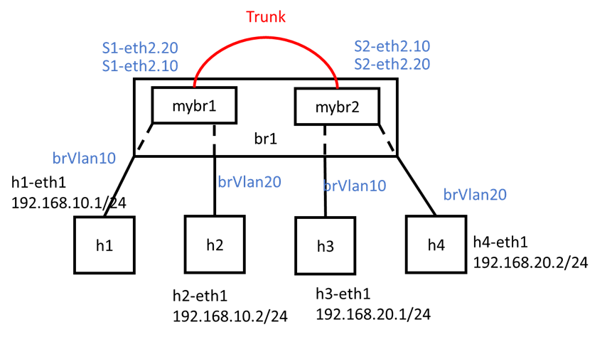

## Vlan實驗

* Vlan打標籤
    

    1. python code (example code/vlan1.py)
        ```py
        #!/usr/bin/env python
        from mininet.cli import CLI
        from mininet.net import Mininet
        from mininet.link import Link,TCLink

        if '__main__' == __name__:
        net = Mininet(link=TCLink)
        h1 = net.addHost('h1')
        h2 = net.addHost('h2')
        h3 = net.addHost('h3')
        h4 = net.addHost('h4')
        s1 = net.addHost('s1')
        s2 = net.addHost('s2') 
        Link(h1, s1)
        Link(h2, s1)
        Link(h3, s2)
        Link(h4, s2)
        Link(s1, s2)
        net.build()
        h1.cmd("ifconfig h1-eth0 0")
        h2.cmd("ifconfig h2-eth0 0")
        h3.cmd("ifconfig h3-eth0 0")
        h4.cmd("ifconfig h4-eth0 0")
        s1.cmd("ifconfig s1-eth0 0")
        s1.cmd("ifconfig s1-eth1 0")
        s1.cmd("ifconfig s1-eth2 0")
        s2.cmd("ifconfig s2-eth0 0")
        s2.cmd("ifconfig s2-eth1 0")
        s2.cmd("ifconfig s2-eth2 0")
        s1.cmd("vconfig add s1-eth2 10")
        s1.cmd("vconfig add s1-eth2 20")
        s2.cmd("vconfig add s2-eth2 10")
        s2.cmd("vconfig add s2-eth2 20")
        s1.cmd("brctl addbr brvlan10")
        s1.cmd("brctl addbr brvlan20")
        s2.cmd("brctl addbr brvlan10")
        s2.cmd("brctl addbr brvlan20")
        s1.cmd("brctl addif brvlan10 s1-eth0")
        s1.cmd("brctl addif brvlan20 s1-eth1")
        s1.cmd("brctl addif brvlan10 s1-eth2.10")
        s1.cmd("brctl addif brvlan20 s1-eth2.20")
        s2.cmd("brctl addif brvlan10 s2-eth0")
        s2.cmd("brctl addif brvlan20 s2-eth1")
        s2.cmd("brctl addif brvlan10 s2-eth2.10")
        s2.cmd("brctl addif brvlan20 s2-eth2.20")
        s1.cmd("ifconfig brvlan10 up")
        s1.cmd("ifconfig brvlan20 up")
        s2.cmd("ifconfig brvlan10 up")
        s2.cmd("ifconfig brvlan20 up")
        s1.cmd("ifconfig s1-eth2.10 up")
        s1.cmd("ifconfig s1-eth2.20 up")
        s2.cmd("ifconfig s2-eth2.10 up")
        s2.cmd("ifconfig s2-eth2.20 up")
        h1.cmd("ip addr add 192.168.10.1/24 brd + dev h1-eth0")
        h2.cmd("ip addr add 192.168.10.2/24 brd + dev h2-eth0")
        h3.cmd("ip addr add 192.168.10.3/24 brd + dev h3-eth0")
        h4.cmd("ip addr add 192.168.10.4/24 brd + dev h4-eth0")
        CLI(net)
        net.stop()
        ```
    2. 實驗結果如下：h1可以互pingh3、h2可以互pingh4，但h1和h2無法互ping
    
    3. 查看wireshark在s1-eth2結出來的封包，上面有打上10標籤(`h1 ping h3`)
    

* 單臂路由
    
    1. python code (example code/vlan2.py)
        ```py
        from mininet.cli import CLI
        from mininet.net import Mininet
        from mininet.link import Link,TCLink

        if '__main__' == __name__:
        net = Mininet(link=TCLink)
        h1 = net.addHost('h1')
        h2 = net.addHost('h2')
        h3 = net.addHost('h3')
        h4 = net.addHost('h4')
        s1 = net.addHost('s1')
        s2 = net.addHost('s2') 
        s3 = net.addHost('s3')
        r1 = net.addHost('r1')
        Link(h1, s1)
        Link(h2, s1)
        Link(h3, s2)
        Link(h4, s2)
        Link(s1, s3)
        Link(s2, s3)
        Link(s3, r1)
        net.build()
        h1.cmd("ifconfig h1-eth0 0")
        h2.cmd("ifconfig h2-eth0 0")
        h3.cmd("ifconfig h3-eth0 0")
        h4.cmd("ifconfig h4-eth0 0")
        s1.cmd("ifconfig s1-eth0 0")
        s1.cmd("ifconfig s1-eth1 0")
        s1.cmd("ifconfig s1-eth2 0")
        s2.cmd("ifconfig s2-eth0 0")
        s2.cmd("ifconfig s2-eth1 0")
        s2.cmd("ifconfig s2-eth2 0")
        s3.cmd("ifconfig s3-eth0 0")
        s3.cmd("ifconfig s3-eth1 0")
        s3.cmd("ifconfig s3-eth2 0")
        r1.cmd("ifconfig r1-eth0 0")
        s1.cmd("vconfig add s1-eth2 10")
        s1.cmd("vconfig add s1-eth2 20")
        s2.cmd("vconfig add s2-eth2 10")
        s2.cmd("vconfig add s2-eth2 20")
        s3.cmd("vconfig add s3-eth0 10")
        s3.cmd("vconfig add s3-eth0 20")
        s3.cmd("vconfig add s3-eth1 10")
        s3.cmd("vconfig add s3-eth1 20")
        s3.cmd("vconfig add s3-eth2 10")
        s3.cmd("vconfig add s3-eth2 20")
        r1.cmd("vconfig add r1-eth0 10")
        r1.cmd("vconfig add r1-eth0 20")
        s1.cmd("ifconfig s1-eth2.10 up")
        s1.cmd("ifconfig s1-eth2.20 up")
        s2.cmd("ifconfig s2-eth2.10 up")
        s2.cmd("ifconfig s2-eth2.20 up")
        s3.cmd("ifconfig s3-eth0.10 up")
        s3.cmd("ifconfig s3-eth0.20 up")
        s3.cmd("ifconfig s3-eth1.10 up")
        s3.cmd("ifconfig s3-eth1.20 up")
        s3.cmd("ifconfig s3-eth2.10 up")
        s3.cmd("ifconfig s3-eth2.20 up")
        r1.cmd("ifconfig r1-eth0.10 up")
        r1.cmd("ifconfig r1-eth0.20 up")
        s1.cmd("brctl addbr brvlan10")
        s1.cmd("brctl addbr brvlan20")
        s2.cmd("brctl addbr brvlan10")
        s2.cmd("brctl addbr brvlan20")
        s3.cmd("brctl addbr brvlan10")
        s3.cmd("brctl addbr brvlan20")
        s1.cmd("ifconfig brvlan10 up")
        s1.cmd("ifconfig brvlan20 up")
        s2.cmd("ifconfig brvlan10 up")
        s2.cmd("ifconfig brvlan20 up")
        s3.cmd("ifconfig brvlan10 up")
        s3.cmd("ifconfig brvlan20 up")
        s1.cmd("brctl addif brvlan10 s1-eth0")
        s1.cmd("brctl addif brvlan20 s1-eth1")
        s1.cmd("brctl addif brvlan10 s1-eth2.10")
        s1.cmd("brctl addif brvlan20 s1-eth2.20")
        s2.cmd("brctl addif brvlan10 s2-eth0")
        s2.cmd("brctl addif brvlan20 s2-eth1")
        s2.cmd("brctl addif brvlan10 s2-eth2.10")
        s2.cmd("brctl addif brvlan20 s2-eth2.20")
        s3.cmd("brctl addif brvlan10 s3-eth0.10")
        s3.cmd("brctl addif brvlan10 s3-eth1.10")
        s3.cmd("brctl addif brvlan10 s3-eth2.10")
        s3.cmd("brctl addif brvlan20 s3-eth0.20")
        s3.cmd("brctl addif brvlan20 s3-eth1.20")
        s3.cmd("brctl addif brvlan20 s3-eth2.20")
        h1.cmd("ip addr add 192.168.10.1/24 brd + dev h1-eth0")
        h1.cmd("ip route add default via 192.168.10.254")
        h2.cmd("ip addr add 192.168.20.1/24 brd + dev h2-eth0")
        h2.cmd("ip route add default via 192.168.20.254")
        h3.cmd("ip addr add 192.168.10.2/24 brd + dev h3-eth0")
        h3.cmd("ip route add default via 192.168.10.254")
        h4.cmd("ip addr add 192.168.20.2/24 brd + dev h4-eth0")
        h4.cmd("ip route add default via 192.168.20.254")
        r1.cmd("ip addr add 192.168.10.254/24 brd + dev r1-eth0.10")
        r1.cmd("ip addr add 192.168.20.254/24 brd + dev r1-eth0.20")
        r1.cmd("echo 1 > /proc/sys/net/ipv4/ip_forward")
        CLI(net)
        net.stop()
        ```
    2. h1 可以 ping h2、h3、h4
    


* 單臂路由
    
    1. python code (example code/vlan2.py)
        ```py
        from mininet.cli import CLI
        from mininet.net import Mininet
        from mininet.link import Link,TCLink

        if '__main__' == __name__:
        net = Mininet(link=TCLink)
        h1 = net.addHost('h1')
        h2 = net.addHost('h2')
        h3 = net.addHost('h3')
        h4 = net.addHost('h4')
        s1 = net.addHost('s1')
        s2 = net.addHost('s2') 
        s3 = net.addHost('s3')
        r1 = net.addHost('r1')
        Link(h1, s1)
        Link(h2, s1)
        Link(h3, s2)
        Link(h4, s2)
        Link(s1, s3)
        Link(s2, s3)
        Link(s3, r1)
        net.build()
        h1.cmd("ifconfig h1-eth0 0")
        h2.cmd("ifconfig h2-eth0 0")
        h3.cmd("ifconfig h3-eth0 0")
        h4.cmd("ifconfig h4-eth0 0")
        s1.cmd("ifconfig s1-eth0 0")
        s1.cmd("ifconfig s1-eth1 0")
        s1.cmd("ifconfig s1-eth2 0")
        s2.cmd("ifconfig s2-eth0 0")
        s2.cmd("ifconfig s2-eth1 0")
        s2.cmd("ifconfig s2-eth2 0")
        s3.cmd("ifconfig s3-eth0 0")
        s3.cmd("ifconfig s3-eth1 0")
        s3.cmd("ifconfig s3-eth2 0")
        r1.cmd("ifconfig r1-eth0 0")
        s1.cmd("vconfig add s1-eth2 10")
        s1.cmd("vconfig add s1-eth2 20")
        s2.cmd("vconfig add s2-eth2 10")
        s2.cmd("vconfig add s2-eth2 20")
        s3.cmd("vconfig add s3-eth0 10")
        s3.cmd("vconfig add s3-eth0 20")
        s3.cmd("vconfig add s3-eth1 10")
        s3.cmd("vconfig add s3-eth1 20")
        s3.cmd("vconfig add s3-eth2 10")
        s3.cmd("vconfig add s3-eth2 20")
        r1.cmd("vconfig add r1-eth0 10")
        r1.cmd("vconfig add r1-eth0 20")
        s1.cmd("ifconfig s1-eth2.10 up")
        s1.cmd("ifconfig s1-eth2.20 up")
        s2.cmd("ifconfig s2-eth2.10 up")
        s2.cmd("ifconfig s2-eth2.20 up")
        s3.cmd("ifconfig s3-eth0.10 up")
        s3.cmd("ifconfig s3-eth0.20 up")
        s3.cmd("ifconfig s3-eth1.10 up")
        s3.cmd("ifconfig s3-eth1.20 up")
        s3.cmd("ifconfig s3-eth2.10 up")
        s3.cmd("ifconfig s3-eth2.20 up")
        r1.cmd("ifconfig r1-eth0.10 up")
        r1.cmd("ifconfig r1-eth0.20 up")
        s1.cmd("brctl addbr brvlan10")
        s1.cmd("brctl addbr brvlan20")
        s2.cmd("brctl addbr brvlan10")
        s2.cmd("brctl addbr brvlan20")
        s3.cmd("brctl addbr brvlan10")
        s3.cmd("brctl addbr brvlan20")
        s1.cmd("ifconfig brvlan10 up")
        s1.cmd("ifconfig brvlan20 up")
        s2.cmd("ifconfig brvlan10 up")
        s2.cmd("ifconfig brvlan20 up")
        s3.cmd("ifconfig brvlan10 up")
        s3.cmd("ifconfig brvlan20 up")
        s1.cmd("brctl addif brvlan10 s1-eth0")
        s1.cmd("brctl addif brvlan20 s1-eth1")
        s1.cmd("brctl addif brvlan10 s1-eth2.10")
        s1.cmd("brctl addif brvlan20 s1-eth2.20")
        s2.cmd("brctl addif brvlan10 s2-eth0")
        s2.cmd("brctl addif brvlan20 s2-eth1")
        s2.cmd("brctl addif brvlan10 s2-eth2.10")
        s2.cmd("brctl addif brvlan20 s2-eth2.20")
        s3.cmd("brctl addif brvlan10 s3-eth0.10")
        s3.cmd("brctl addif brvlan10 s3-eth1.10")
        s3.cmd("brctl addif brvlan10 s3-eth2.10")
        s3.cmd("brctl addif brvlan20 s3-eth0.20")
        s3.cmd("brctl addif brvlan20 s3-eth1.20")
        s3.cmd("brctl addif brvlan20 s3-eth2.20")
        h1.cmd("ip addr add 192.168.10.1/24 brd + dev h1-eth0")
        h1.cmd("ip route add default via 192.168.10.254")
        h2.cmd("ip addr add 192.168.20.1/24 brd + dev h2-eth0")
        h2.cmd("ip route add default via 192.168.20.254")
        h3.cmd("ip addr add 192.168.10.2/24 brd + dev h3-eth0")
        h3.cmd("ip route add default via 192.168.10.254")
        h4.cmd("ip addr add 192.168.20.2/24 brd + dev h4-eth0")
        h4.cmd("ip route add default via 192.168.20.254")
        r1.cmd("ip addr add 192.168.10.254/24 brd + dev r1-eth0.10")
        r1.cmd("ip addr add 192.168.20.254/24 brd + dev r1-eth0.20")
        r1.cmd("echo 1 > /proc/sys/net/ipv4/ip_forward")
        CLI(net)
        net.stop()
        ```
    2. h1 可以 ping h2、h3、h4
    

* 3nodes 1 hub
    
    1. python code (example code/hub1.py)
        ```py
        from mininet.cli import CLI
        from mininet.net import Mininet
        from mininet.link import Link,TCLink,Intf
        
        if '__main__' == __name__:
            net = Mininet(link=TCLink)
            h1 = net.addHost('h1', mac='00:00:00:00:01:00')
            h2 = net.addHost('h2', mac='00:00:00:00:02:00')
            h3 = net.addHost('h3', mac='00:00:00:00:03:00')
            h4 = net.addHost('h4', mac='00:00:00:00:04:00')
            Link(h1, h4)
            Link(h2, h4)
            Link(h3, h4)
            net.build()
            h4.cmd("ifconfig h4-eth0 0")
            h4.cmd("ifconfig h4-eth1 0")
            h4.cmd("ifconfig h4-eth2 0")
            h4.cmd("brctl addbr br0")
            h4.cmd("brctl addif br0 h4-eth0")
            h4.cmd("brctl addif br0 h4-eth1")
            h4.cmd("brctl addif br0 h4-eth2")
            h4.cmd("brctl setageing br0 0")
            h4.cmd("ifconfig br0 up")
            CLI(net)
            net.stop()
        ```
    2. 在h1 ping h2的同時我們開啟wireshark擷取h3-eth0的所有封包會發現，h3也會收的到封包
    

##open vSwitch

* 刪除
    ```
    ovs-ofclt  del-flows s1 
    ```

* 顯示
    ```
    ovs-ofclt  dump-flows s1 
    ```

* 設定
    ```
    ovs-ofctl add-flow s1 in_port=1,action=output:2
    ovs-ofctl add-flow s1 in_port=2,action=output:1
    ```

* 刪除特定規則
    ```
    ovs-ofctl del-flow s1 in_port=1
    ```

* 建立拓譜
    ```
    mn --topo single,2
    ```

* 3nodes 1 switch 1 controller
    Arp
    ```
    ovs-ofctl add-flow s1 in_put=1,arp,actions=output:flood
    ovs-ofctl add-flow s1 in_put=2,arp,actions=output:flood
    ovs-ofctl add-flow s1 in_put=3,arp,actions=output:flood
    ovs-ofctl add-flow s1 ip,nw_dst=10.0.0.1,actions=output:1
    ovs-ofctl add-flow s1 ip,nw_dst=10.0.0.2,actions=output:2
    ovs-ofctl add-flow s1 ip,nw_dst=10.0.0.3,actions=output:3
    ```
