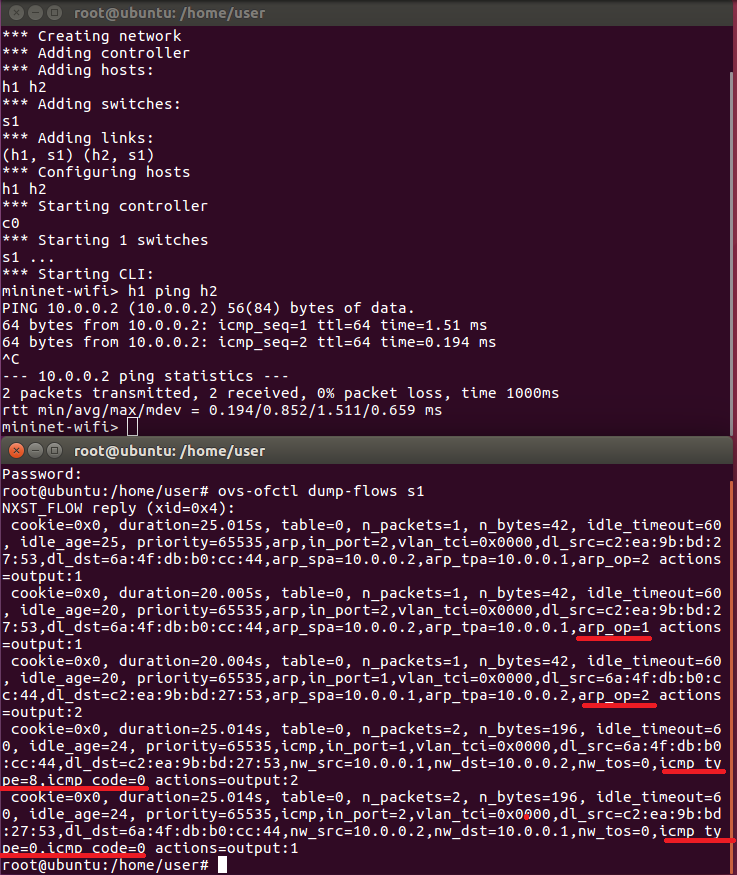
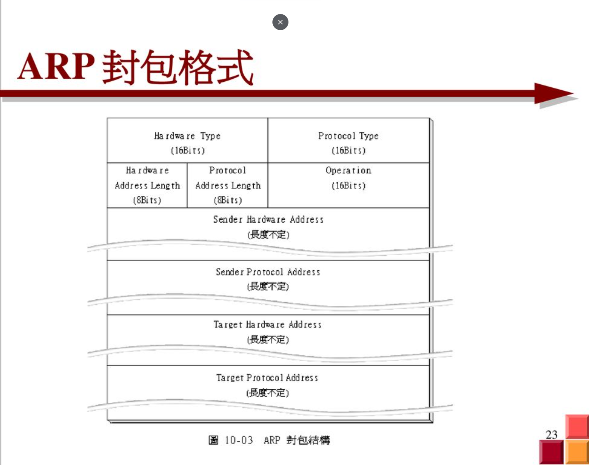
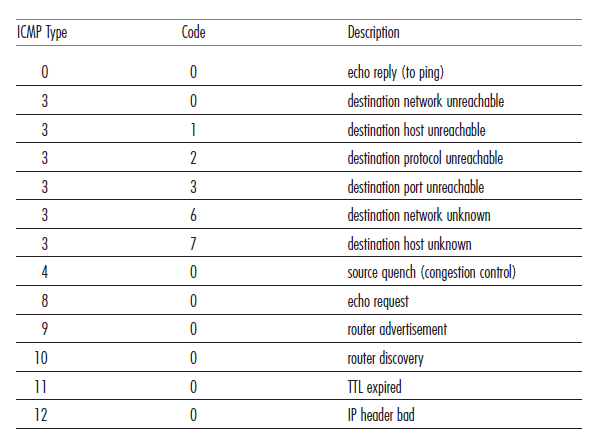
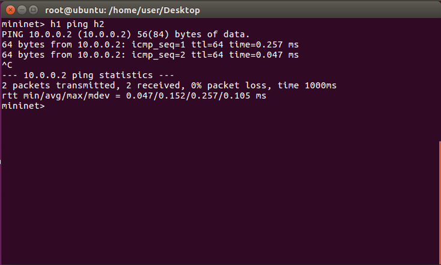
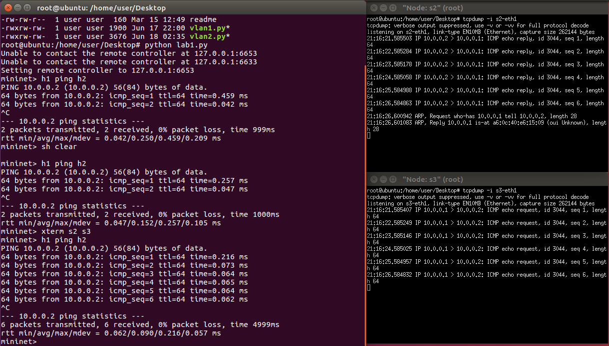
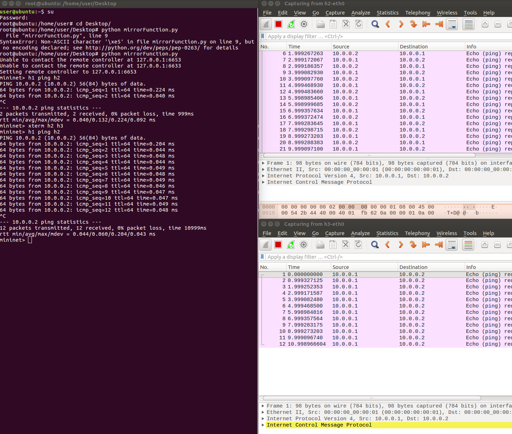
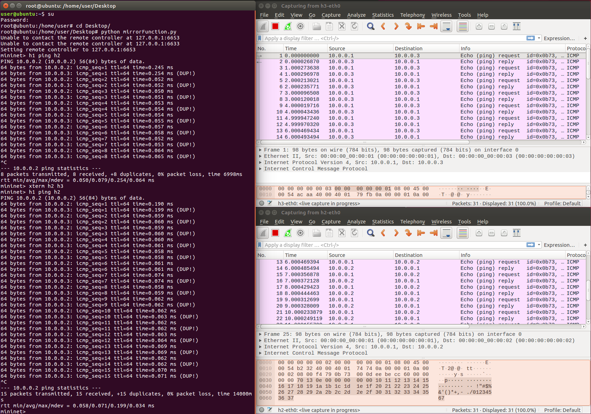

## ovs

* 創造2nodes 1switch 看看規則
    1. 在ubuntu環境下輸入
        ```
        ubuntu>  mn --topo single,2
        ```
    2. 在mn環境下輸入
        ```
        mn> h1 ping h2
        ```
    3. 另開一個終端機輸入
        ```
        ubuntu> ovs-ofctl dump-flows s1
        ```
    
    4. 來看看arp封包的格式和icmp type的格式
    
    

    5. 由結果可推知以下幾點：
        * arp_spa：來源 IP
        * arp_tpa：目標 IP
        * arp request：arp_op=1
        * arp reply：arp_op=2
        * icmp request：icmp_type=8, icmp_code=0
        * icmp reply：icmp_type=0, icmp_code=0

* 讓icmp request與reply分開傳送，2nodes 3controllers
    
    1. python code (example code/lab1.py)
    ```py
        from mininet.cli import CLI
        from mininet.net import Mininet
        from mininet.link import Link,TCLink,Intf
        from mininet.node import Controller,RemoteController

        if '__main__' == __name__:
            net = Mininet(link=TCLink)
            h1 = net.addHost('h1')
            h2 = net.addHost('h2')
            s1 = net.addSwitch('s1')
            s2 = net.addSwitch('s2')
            s3 = net.addSwitch('s3')

            c0 = net.addController('c0', controller=RemoteController)

            net.addLink(h1, s1)
            net.addLink(s1, s2)
            net.addLink(s2, h2)
            net.addLink(s1, s3)
            net.addLink(s2, s3)
            net.build()
            c0.start()
            s1.start([c0])
            s2.start([c0])
            s3.start([c0])

            #s1
            s1.cmd("ovs-ofctl add-flow s1 arp,arp_spa=10.0.0.1,arp_tpa=10.0.0.2,arp_op=1,actions=output:2")
            s1.cmd("ovs-ofctl add-flow s1 arp,arp_spa=10.0.0.2,arp_tpa=10.0.0.1,arp_op=2,actions=output:1")
            s1.cmd("ovs-ofctl add-flow s1 arp,arp_spa=10.0.0.2,arp_tpa=10.0.0.1,arp_op=1,actions=output:1")
            s1.cmd("ovs-ofctl add-flow s1 arp,arp_spa=10.0.0.1,arp_tpa=10.0.0.2,arp_op=2,actions=output:2")
            s1.cmd("ovs-ofctl add-flow s1 icmp,nw_src=10.0.0.1,nw_dst=10.0.0.2,icmp_type=8,icmp_code=0,actions=output:3")
            s1.cmd("ovs-ofctl add-flow s1 icmp,nw_src=10.0.0.2,nw_dst=10.0.0.1,icmp_type=0,icmp_code=0,actions=output:1")
            s1.cmd("ovs-ofctl add-flow s1 icmp,nw_src=10.0.0.2,nw_dst=10.0.0.1,icmp_type=8,icmp_code=0,actions=output:1")
            s1.cmd("ovs-ofctl add-flow s1 icmp,nw_src=10.0.0.1,nw_dst=10.0.0.2,icmp_type=0,icmp_code=0,actions=output:2")

            #s2
            s2.cmd("ovs-ofctl add-flow s2 arp,arp_spa=10.0.0.1,arp_tpa=10.0.0.2,arp_op=1,actions=output:2")
            s2.cmd("ovs-ofctl add-flow s2 arp,arp_spa=10.0.0.2,arp_tpa=10.0.0.1,arp_op=2,actions=output:1")
            s2.cmd("ovs-ofctl add-flow s2 arp,arp_spa=10.0.0.2,arp_tpa=10.0.0.1,arp_op=1,actions=output:1")
            s2.cmd("ovs-ofctl add-flow s2 arp,arp_spa=10.0.0.1,arp_tpa=10.0.0.2,arp_op=2,actions=output:2")
            s2.cmd("ovs-ofctl add-flow s2 icmp,nw_src=10.0.0.1,nw_dst=10.0.0.2,icmp_type=8,icmp_code=0,actions=output:2")
            s2.cmd("ovs-ofctl add-flow s2 icmp,nw_src=10.0.0.2,nw_dst=10.0.0.1,icmp_type=0,icmp_code=0,actions=output:1")
            s2.cmd("ovs-ofctl add-flow s2 icmp,nw_src=10.0.0.2,nw_dst=10.0.0.1,icmp_type=8,icmp_code=0,actions=output:3")
            s2.cmd("ovs-ofctl add-flow s2 icmp,nw_src=10.0.0.1,nw_dst=10.0.0.2,icmp_type=0,icmp_code=0,actions=output:2")

            #s3
            s3.cmd("ovs-ofctl add-flow s3 icmp,nw_src=10.0.0.1,nw_dst=10.0.0.2,icmp_type=8,icmp_code=0,actions=output:2")
            s3.cmd("ovs-ofctl add-flow s3 icmp,nw_src=10.0.0.2,nw_dst=10.0.0.1,icmp_type=8,icmp_code=0,actions=output:1")

            CLI(net)
            net.stop()
    ```
    2. 測試是否可以ping
    
    3. 在h1 ping h2 時監聽s2與s3的封包
    

* Mirror function 
    
    1. python code (example code/mirrorFunction1.py)
    ```py
        from mininet.cli import CLI
        from mininet.net import Mininet
        from mininet.link import Link,TCLink,Intf
        from mininet.node import Controller,RemoteController

        if '__main__' == __name__:
            net = Mininet(link=TCLink)

            # 在新增節點的時候，設定 IP 和 MAC Address
            h1 = net.addHost('h1', ip="10.0.0.1/24", mac="00:00:00:00:00:01")
            h2 = net.addHost('h2', ip="10.0.0.2/24", mac="00:00:00:00:00:02")
            h3 = net.addHost('h3', ip="10.0.0.3/24", mac="00:00:00:00:00:03")
            s1 = net.addSwitch('s1')
            c0 = net.addController('c0', controller=RemoteController)
            net.addLink(h1, s1)
            net.addLink(h2, s1)
            net.addLink(h3, s1)
            net.build()
            c0.start()
            s1.start([c0])
            h1.cmd("arp -s 10.0.0.2 00:00:00:00:00:02")
            h1.cmd("arp -s 10.0.0.3 00:00:00:00:00:03")
            h2.cmd("arp -s 10.0.0.1 00:00:00:00:00:01")
            h2.cmd("arp -s 10.0.0.3 00:00:00:00:00:03")
            h3.cmd("arp -s 10.0.0.1 00:00:00:00:00:01")
            h3.cmd("arp -s 10.0.0.2 00:00:00:00:00:02")

            CLI(net)
            net.stop()
    ```
    2. 當規則均符合，優先權大的為優先
    ```
    ovs-ofctl add-flow s1 priority=1,ip,nw_dst=10.0.0.1,actions=output:1
    ovs-ofctl add-flow s1 priority=1,ip,nw_dst=10.0.0.2,actions=output:2
    ovs-ofctl add-flow s1 priority=1,ip,nw_dst=10.0.0.3,actions=output:3
    ovs-ofctl add-flow s1 priority=10,ip,nw_src=10.0.0.1,nw_dst=10.0.0.2,actions=output:2,output:3
    ```
    3. 在h1 ping h2時，我們開啟h2和h3的wireshark看看封包有沒有收到。
    
    h2 h3 事都有收到的，但是h3只有收到requedt並沒有辦法relpy。
    4. 解決方法：新增規則，更改目的端 IP、MAC Address
    ```
    ovs-ofctl add-flow s1 priority=100,ip,nw_src=10.0.0.1,nw_dst=10.0.0.2,actions=output:2,mod_nw_dst=10.0.0.3,mod_dl_dst:00:00:00:00:00:03,output:3
    ```
    