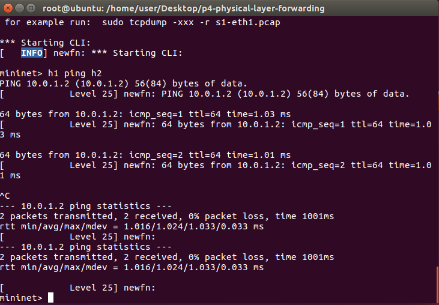

## SDN:openflow與p4的差異
1. 早期的 sdn 是 bottom-up design，需要從底層的限制去往上發展。而 P4 是 top-down design，是底層去配合上層的動作

2. openflow的controller與openVSwitch連線中斷的話，就會error，但在p4有額外提供registeer、meter、counter，可以把規則寫在裡面，即使今天controller中斷了，也可依照先前寫的規則去運作

3. openflow不可儲存status，但p4可以運用registeer、meter、counter去儲存status

4. 例如：round robin附載均衡器，會依照連線順序依序輪迴分配給不同伺服器，但在此同時必須讓它記得status
---
## 環境

* p4版本：16
* 使用此框架的好處是只要準備3個檔案即可：
    - p4app.json
    - basic.p4
    - cmd.txt
* p4-utils是遵循v1 model的規則

    - parser：拆解封包，去了解header的資訊
    - verify checksum：封包的驗證
        > 第二層可以不管，但如果是第三層設備就要做處理了。
    - ingress：封包進來要怎麼處理(進)
    - egress：封包出去要怎麼處理(出)
    - compute checksum：重新計算檢查碼，因為封包進來會因為ttl要處理。
        > 第二層可以不管，但如果是第三層設備就要做處理了。
        
-----

* p4 實體層轉發（physical layer forwarding）
    - basic.p4經過編譯後會生成 basic.json
    - cmd.txt 可以看作是rule.sh
    
    

    1. p4app.json code(example code/p4-physical-layer-forwarding/p4app.json)
    ```json
    {

        "program": "basic.p4",

        "switch": "simple_switch",

        "compiler": "p4c",

        "options": "--target bmv2 --arch v1model --std p4-16",

        "switch_cli": "simple_switch_CLI",

        "cli": true,

        "pcap_dump": true,

        "enable_log": true,

        "topo_module": {

        "file_path": "",

        "module_name": "p4utils.mininetlib.apptopo",

        "object_name": "AppTopoStrategies"

        },

        "controller_module": null,

        "topodb_module": {

        "file_path": "",

        "module_name": "p4utils.utils.topology",

        "object_name": "Topology"

        },

        "mininet_module": {

        "file_path": "",

        "module_name": "p4utils.mininetlib.p4net",

        "object_name": "P4Mininet"

        },

        "topology": {

        "assignment_strategy": "l2",

        "links": [["h1", "s1"], ["h2", "s1"]],

        "hosts": {

            "h1": {

            },

            "h2": {

            }

        },

        "switches": {

            "s1": {

            "cli_input": "cmd.txt",

            "program": "basic.p4"

            }

        }

        }

    }
    ```
    2. basic.p4 code(example code/p4-physical-layer-forwarding/basic.p4)
    ```
    /* -*- P4_16 -*- */
    #include <core.p4>
    #include <v1model.p4>

    /*************************************************************************
    *********************** H E A D E R S  ***********************************
    *************************************************************************/
    
    struct metadata {
        /* empty */
    }

    

    struct headers {
    }

    

    /*************************************************************************
    *********************** P A R S E R  ***********************************
    *************************************************************************/

    parser MyParser(packet_in packet,
                    out headers hdr,
                    inout metadata meta,
                    inout standard_metadata_t standard_metadata) {

        state start {
            transition accept;
        }

    }

    

    /*************************************************************************

    ************   C H E C K S U M    V E R I F I C A T I O N   *************

    *************************************************************************/

    

    control MyVerifyChecksum(inout headers hdr, inout metadata meta) {  
        apply {  }
    }

    /*************************************************************************
    **************  I N G R E S S   P R O C E S S I N G   *******************
    *************************************************************************/
    control MyIngress(inout headers hdr,
                    inout metadata meta,
                    inout standard_metadata_t standard_metadata) {
        action drop() {
            mark_to_drop(standard_metadata);
        }

        action forward(bit<9> port) {
            standard_metadata.egress_spec = port;
        }

        table phy_forward {
            key = {
                standard_metadata.ingress_port: exact;
            }

            actions = {
                forward;
                drop;
            }
            size = 1024;
            default_action = drop();
        }

        apply {
            phy_forward.apply();
        }
    }

    /*************************************************************************
    ****************  E G R E S S   P R O C E S S I N G   *******************
    *************************************************************************/

    control MyEgress(inout headers hdr,
                    inout metadata meta,
                    inout standard_metadata_t standard_metadata) {
        apply {  }
    }

    /*************************************************************************
    *************   C H E C K S U M    C O M P U T A T I O N   **************
    *************************************************************************/

    control MyComputeChecksum(inout headers  hdr, inout metadata meta) {
        apply {
        }
    }

    /*************************************************************************
    ***********************  D E P A R S E R  *******************************
    *************************************************************************/

    control MyDeparser(packet_out packet, in headers hdr) {
        apply {
        }
    }

    /*************************************************************************
    ***********************  S W I T C H  *******************************
    *************************************************************************/

    V1Switch(
    MyParser(),
    MyVerifyChecksum(),
    MyIngress(),
    MyEgress(),
    MyComputeChecksum(),
    MyDeparser()

    ) main;
    ```

    3. cmd.txt(example code/p4-physical-layer-forwarding/cmd.txt)
    ```sh
    table_add phy_forward forward 1 => 2
    table_add phy_forward forward 2 => 1
    ```

    4. 執行
    ubuntu> `p4run`
    
    5. 與switch連線與下指令， 預設 port 會從 9090 開始
    mininet> `simple_switch_CLI --thrift-port 9090`

* 2hosts 2 p4 switch

    
    1. p4app.json (example code/1-1/p4app.json)
    ```json
    {

        "program": "basic.p4",

        "switch": "simple_switch",

        "compiler": "p4c",

        "options": "--target bmv2 --arch v1model --std p4-16",

        "switch_cli": "simple_switch_CLI",

        "cli": true,

        "pcap_dump": true,

        "enable_log": true,

        "topo_module": {

            "file_path": "",

            "module_name": "p4utils.mininetlib.apptopo",

            "object_name": "AppTopoStrategies"

        },

        "controller_module": null,

        "topodb_module": {

            "file_path": "",

            "module_name": "p4utils.utils.topology",

            "object_name": "Topology"

        },

        "mininet_module": {

            "file_path": "",

            "module_name": "p4utils.mininetlib.p4net",

            "object_name": "P4Mininet"

        },

        "topology": {
            "assignment_strategy": "l2", 

            "links": [["h1", "s1"], ["h2", "s2"], ["s1", "s2"]],

            "hosts": {

            "h1": {

            },

            "h2": {

            }

            },

            "switches": {

            "s1": {
                "cli_input":"cmd1.txt",
                "program": "basic.p4"

            },
            "s2": {
                "cli_input":"cmd2.txt",
                "program": "basic.p4"
            }	

            }

        }

    }
    ```
    2. basic.p4 
    ```
    /* -*- P4_16 -*- */
    #include <core.p4>
    #include <v1model.p4>

    /*************************************************************************
    *********************** H E A D E R S  ***********************************
    *************************************************************************/
    
    struct metadata {
        /* empty */
    }

    

    struct headers {
    }

    

    /*************************************************************************
    *********************** P A R S E R  ***********************************
    *************************************************************************/

    parser MyParser(packet_in packet,
                    out headers hdr,
                    inout metadata meta,
                    inout standard_metadata_t standard_metadata) {

        state start {
            transition accept;
        }

    }

    

    /*************************************************************************

    ************   C H E C K S U M    V E R I F I C A T I O N   *************

    *************************************************************************/

    

    control MyVerifyChecksum(inout headers hdr, inout metadata meta) {  
        apply {  }
    }

    /*************************************************************************
    **************  I N G R E S S   P R O C E S S I N G   *******************
    *************************************************************************/
    control MyIngress(inout headers hdr,
                    inout metadata meta,
                    inout standard_metadata_t standard_metadata) {
        action drop() {
            mark_to_drop(standard_metadata);
        }

        action forward(bit<9> port) {
            standard_metadata.egress_spec = port;
        }

        table phy_forward {
            key = {
                standard_metadata.ingress_port: exact;
            }

            actions = {
                forward;
                drop;
            }
            size = 1024;
            default_action = drop();
        }

        apply {
            phy_forward.apply();
        }
    }

    /*************************************************************************
    ****************  E G R E S S   P R O C E S S I N G   *******************
    *************************************************************************/

    control MyEgress(inout headers hdr,
                    inout metadata meta,
                    inout standard_metadata_t standard_metadata) {
        apply {  }
    }

    /*************************************************************************
    *************   C H E C K S U M    C O M P U T A T I O N   **************
    *************************************************************************/

    control MyComputeChecksum(inout headers  hdr, inout metadata meta) {
        apply {
        }
    }

    /*************************************************************************
    ***********************  D E P A R S E R  *******************************
    *************************************************************************/

    control MyDeparser(packet_out packet, in headers hdr) {
        apply {
        }
    }

    /*************************************************************************
    ***********************  S W I T C H  *******************************
    *************************************************************************/

    V1Switch(
    MyParser(),
    MyVerifyChecksum(),
    MyIngress(),
    MyEgress(),
    MyComputeChecksum(),
    MyDeparser()

    ) main;
    ```
    3. cmd1.txt