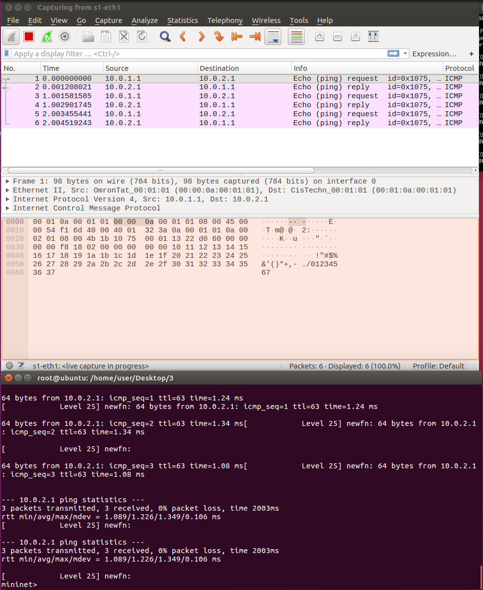
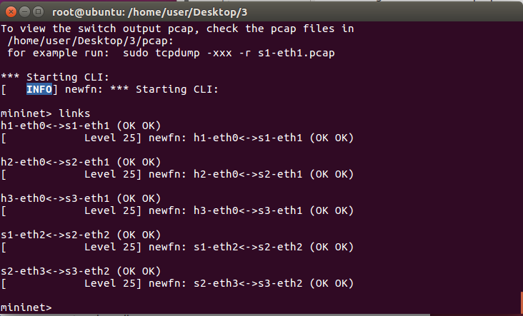

* MAC Layer Forwarding：如果把作為rule的cmd.txt 移除，要如何讓它連線
    1. code(example code/2)
    在這一段code裡，原先s1裡要有`"cli_input": "cmd.txt"`的但如果把這條規則拔掉就不能讓h1 h2 互ping了
    ```json
    {

    "program": "basic.p4",

    "switch": "simple_switch",

    "compiler": "p4c",

    "options": "--target bmv2 --arch v1model --std p4-16",

    "switch_cli": "simple_switch_CLI",

    "cli": true,

    "pcap_dump": true,

    "enable_log": true,

    "topo_module": {

        "file_path": "",

        "module_name": "p4utils.mininetlib.apptopo",

        "object_name": "AppTopoStrategies"

    },

    "controller_module": null,

    "topodb_module": {

        "file_path": "",

        "module_name": "p4utils.utils.topology",

        "object_name": "Topology"

    },

    "mininet_module": {

        "file_path": "",

        "module_name": "p4utils.mininetlib.p4net",

        "object_name": "P4Mininet"

    },

    "topology": {

        "links": [["h1", "s1"], ["h2", "s1"]],

        "hosts": {

        "h1": {

        },

        "h2": {

        }

        },

        "switches": {

        "s1": {


            "program": "basic.p4"

        }

        }

    }

    }
    ```
    2. 讓他可以重ping的兩個方法
        - 1. 將規則改回去
        - 2. 手動新增規則
    3. 手動新增規則方法
        ubuntuu> `simple_switch_CLi --thrift-port 9090`
        RuntimeCmd> `table_add mac_forward forward 00:00:0a:00:01:01 => 1`
        RuntimeCmd> `table_add mac_forward forward 00:00:0a:00:01:02 => 2`

* ip_forward1
    
    1. code (example code/3)
    

* 作業
    
    1. code (example code/0517hw)

    2. p4app.json
    ```json
    {

		"program": "ip_forward.p4",

		"switch": "simple_switch",

		"compiler": "p4c",

		"options": "--target bmv2 --arch v1model --std p4-16",

		"switch_cli": "simple_switch_CLI",

		"cli": true,

		"pcap_dump": true,

		"enable_log": true,

		"topo_module": {

			"file_path": "",

			"module_name": "p4utils.mininetlib.apptopo",

			"object_name": "AppTopoStrategies"

		},

		"controller_module": null,

		"topodb_module": {

			"file_path": "",

			"module_name": "p4utils.utils.topology",

			"object_name": "Topology"

		},

		"mininet_module": {

			"file_path": "",

			"module_name": "p4utils.mininetlib.p4net",

			"object_name": "P4Mininet"

		},

		"topology": {

			"assignment_strategy": "l3",

			"auto_arp_tables": "true",

			"auto_gw_arp": "true",

			"links": [["h1", "s1"], ["h2", "s2"], ["h3", "s3"], ["s1", "s2"], ["s2", "s3"]],

			"hosts": {

				"h1": {

					"ip": "10.1.1.2/24",

					"gw": "10.1.1.254"

				},

				"h2": {

					"ip": "10.2.2.2/24",

				"gw": "10.2.2.254"

				},

				"h3": {

					"ip": "10.3.3.2/24",

					"gw": "10.3.3.254"

				}

			},

			"switches": {

				"s1": {

					"cli_input": "cmd.txt",

					"program": "ip_forward.p4"

				},

				"s2": {

					"cli_input": "cmd2.txt",

					"program": "ip_forward.p4"

				},

				"s3": {

					"cli_input": "cmd3.txt",

					"program": "ip_forward.p4"

				}

			}

		}

	}
    ```
    3. cmd.txt
    ```sh
    #cmd1.txt
    table_add ipv4_lpm set_nhop 10.1.1.2/32 => 00:00:0a:01:01:02 1
    table_add ipv4_lpm set_nhop 10.2.2.2/32 => 00:00:0a:02:02:02 2
    table_add ipv4_lpm set_nhop 10.3.3.2/32 => 00:00:0a:03:03:02 2
    ```
    ```sh
    #cmd2.txt
    table_add ipv4_lpm set_nhop 10.1.1.2/32 => 00:00:0a:01:01:02 2
    table_add ipv4_lpm set_nhop 10.2.2.2/32 => 00:00:0a:02:02:02 1
    table_add ipv4_lpm set_nhop 10.3.3.2/32 => 00:00:0a:03:03:02 3
    ```
     ```sh
    #cmd3.txt
    table_add ipv4_lpm set_nhop 10.1.1.2/32 => 00:00:0a:01:01:02 2
    table_add ipv4_lpm set_nhop 10.2.2.2/32 => 00:00:0a:02:02:02 2
    table_add ipv4_lpm set_nhop 10.3.3.2/32 => 00:00:0a:03:03:02 1
    ```

    4. 成功
    