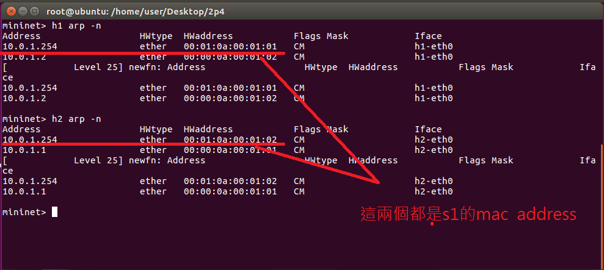
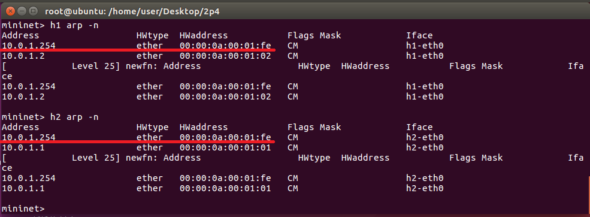
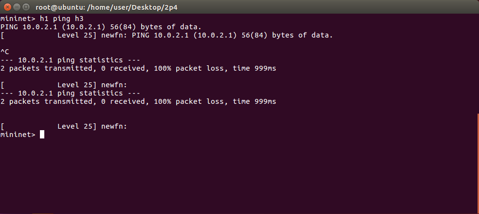
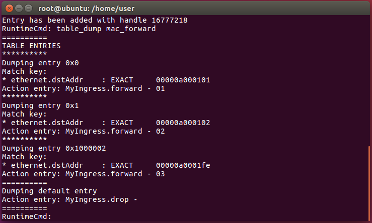
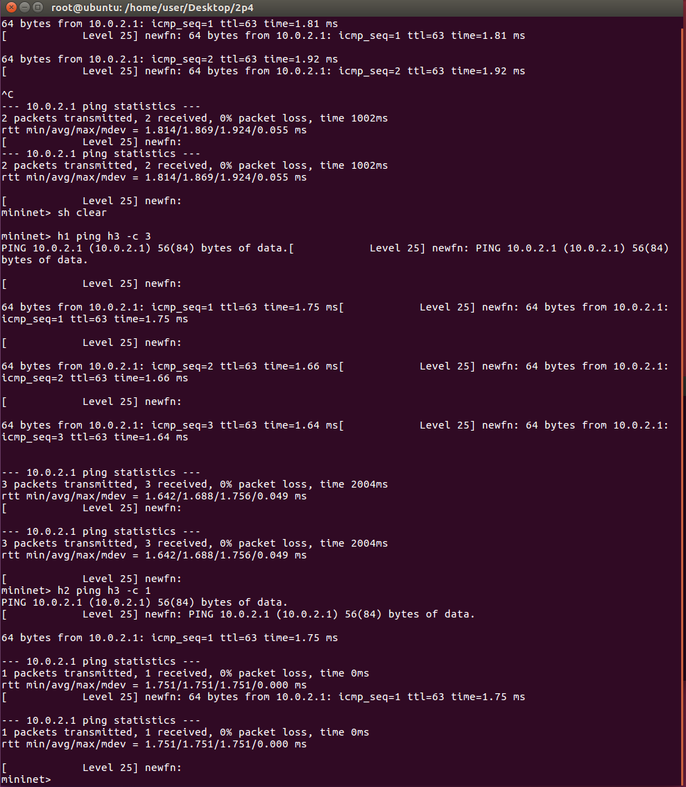
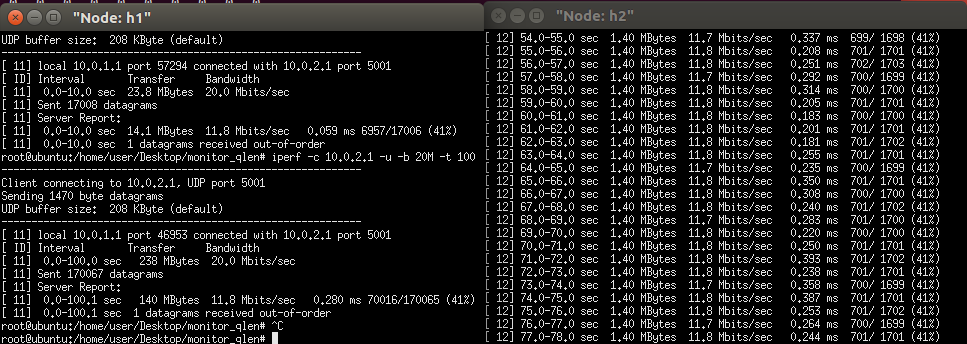
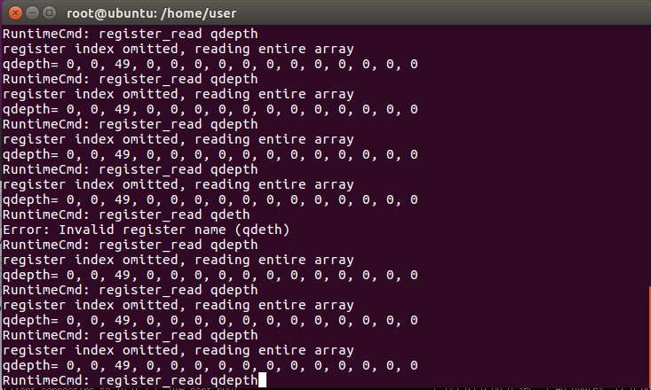

* 3host 2 p4 switch
    
    1. code (example code/2p4)
    2. 如果h2 要 ping h3的話，封包會分成兩段傳送，首先封包會先從h2 傳送至s2，再從s2 傳送至h3

    3. 但如果照原先的程式碼來看的話(example code/2p4)，查詢出來的s1 mac address會是不一樣的。
    
    因為框架的關係，所以在cmd1.txt裡面才會寫成，但其主要的目的還是要讓封包丟向h3
        ```sh
        table_add mac_forward forward 00:00:0a:00:01:01 => 1
        table_add mac_forward forward 00:00:0a:00:01:02 => 2
        table_add mac_forward forward 00:01:0a:00:01:01 => 3
        table_add mac_forward forward 00:01:0a:00:01:02 => 3
        ```

    4. 解決mac address方式
        
        - 1. mininet> `h1 arp -d 10.0.1.254`刪除掉
        - 2. mininet> `h1 arp -s 10.0.1.254 00:00:0a:00:01:FE`h1重新綁定
        - 3. mininet> `h2 arp -d 10.0.1.254`刪除掉
        - 4. mininet> `h2 arp -s 10.0.1.254 00:00:0a:00:01:FE`h2 重新綁定
        
        
            *到這個步驟還不能ping 

        - 5. ubuntu> `simple_switch_CLI --thrift-port 9090`連線至s1進行修改規則
        - 6. RuntimeCmd> `table_dump mac_forward`查看當前封包轉發規則
        - 7. RuntimeCmd> `table_delete mac_forward 2`刪除規則
        - 8. RuntimeCmd> `table_delete mac_forward 3`刪除規則
        - 9. RuntimeCmd>  `table_add mac_forward forward 00:00:0a:00:01:FE => 3`
        
        規則修改完成來看看結果
    5. 成果：h1 ping h3和h2 ping h3都正常
        

## Register & Counter

* register：used to store the data
    > You can use simple switch CLi command to get the vaule stored in the register (write, read)
* counter：used to count the packets numbers and cumulated packet sizes(count, read)

* Register 實驗
    
    1. code (example code/monitor_qlen)

    2. 執行p4run並開啟CLi
        - 1 ubuntu> `p4run`
        - 2 ubuntu> `simple_switch_CLI --thrift-port 9090`
    
    3. 開啟h1 h2 終端機，並讓h1 為客戶端開始傳送封包至h2
        - 1 mininet> `xterm h1 h2 `
        - 2 h1> `iperf -c 10.0.2.1 -u -b 20M -t 100`
        - 3 h2> `iperf -s -i 1 -u`
        
        這時候就會發現傳送速度大概是12M左右，但我們傳送的資料量是20M，明顯封包數量高過她可以處理的量了
        - 4 RuntimeCmd> `register_read qdepth`
        
        由結果可以得知，因為封包數量高過她可以處理的量了，所以有一部分的封包暫時進入駐列

    4. 取出數值
        ubuntu> `echo "register_read qdepth 2" | simple_switch_CLI --thrift-port 9090 | grep qdepth | awk '{print $NF}'`
        - $NF：最後一組資料

* Counter 實驗：取出封包的處理數量(吞吐量)
    
    1. code (example code/monitor_linkbw)

    2. 執行
        - 1 ubuntu> `p4run`
        - 2 ubuntu> `simple_switch_CLI --thrift-port 9090` 
    
    3. 開啟h1 h2 終端機，並讓h1 為客戶端開始傳送封包至h2
        - 1 mininet> `xterm h1 h2 `
        - 2 h1> `iperf -c 10.0.2.1 -u -b 1M -t 10`
        - 3 h2> `iperf -s -i 1 -u`
    4. 取出數值
        ubuntu> `echo "register_read qdepth 2" | simple_switch_CLI --thrift-port 9090 | grep qdepth | awk '{print $NF}'`
        - $NF：最後一組資料