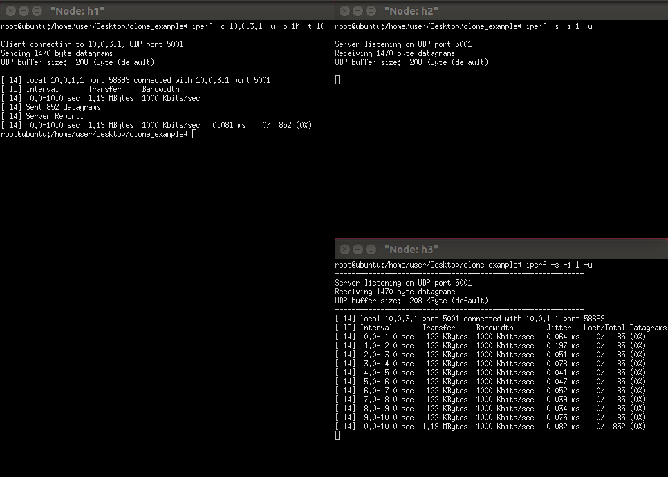
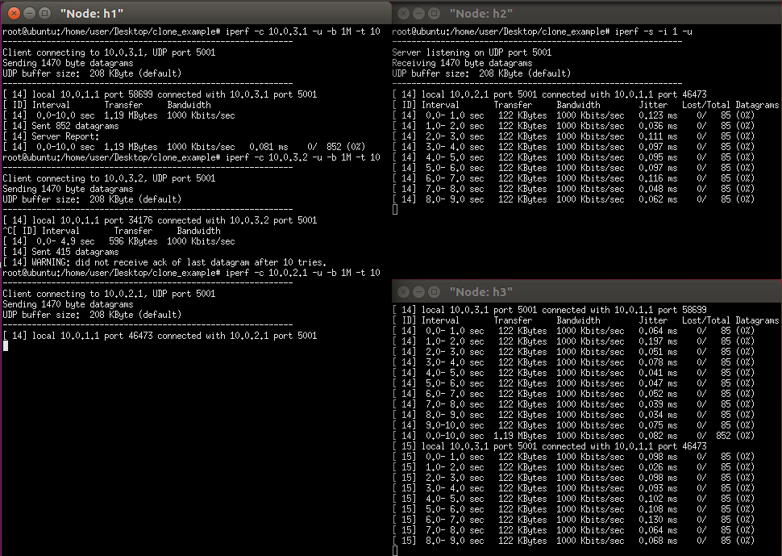
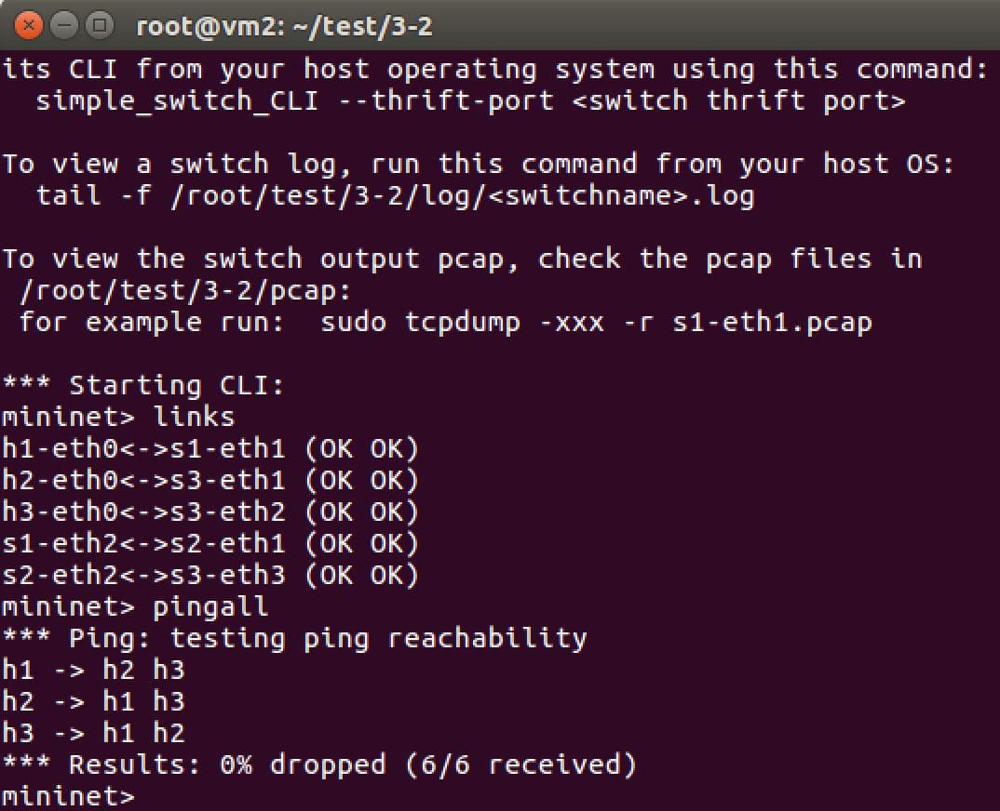
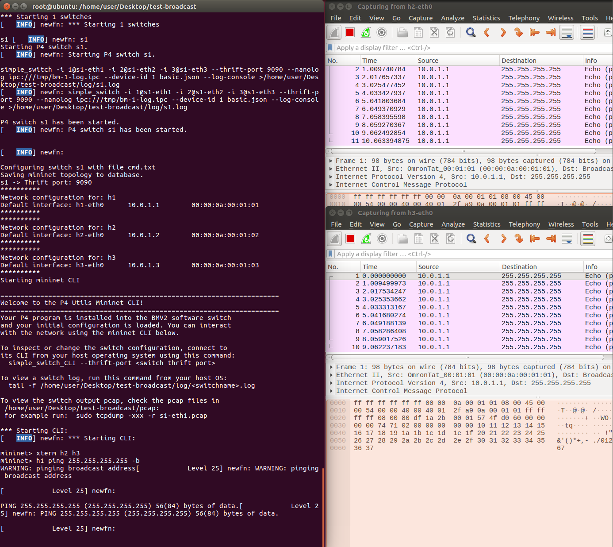

* clone：將 h1 通往 h2 的封包複製一份給 h3
    
    1. code(example code/)：讓h1 傳出來的封包經過s1時把封包複製一份傳給h3，過程中除了要修改目的ip address，也要確認封包是否合法並且為複製的封包
        - cmd.txt
        ```sh
        table_add ipv4_lpm set_nhop 10.0.1.1/32 => 00:00:0a:00:01:01 1
        table_add ipv4_lpm set_nhop 10.0.2.1/32 => 00:00:0a:00:02:01 2
        table_add ipv4_lpm set_nhop 10.0.3.1/32 => 00:00:0a:00:03:01 3
        mirroring_add 250 3
        #session id為250，有這個id的封包要從3號阜傳出去
        ```
        - ip_forward.p4
        ```
        ~~
        if(hdr.ipv4.isValid() && hdr.ipv4.srcAddr==0x0a000101 && hdr.ipv4.dstAddr==0x0a000201) 
        # 確認封包為h1傳出來的且目的端為h2
        ~~
        if (hdr.ipv4.isValid() && standard_metadata.instance_type == 1)
        # 判斷封包是否合法並且為複製的封包
        ~~
        clone(CloneType.I2E, (bit<32>)32w250);
        # 放入session id讓之後封包轉送有關(cmd.txt)
        ```
    2. 若以h1為clinet，h2 h3為server端 開始測試
        - 如果目的端為10.0.3.1的話不會觸發clone
        
        - 如果目的端為10.0.2.1的話會觸發clone
        
        兩邊都有收到封包

* copy to cpu
    
    1. 

* broadcast
    
    1. code code(example code/test-broadcast)：讓 h1、h2、h3 可以各自廣播封包給其他人
        > mc_mgrp_create 1：create a multicast group 1
        > mc_node_create 0 2 3：create a node 0 and link the port 2 and 3 to node 0，設定一個
        > mc_node_associate 1 0：associate multicast group 1 with node 0

        - cmd.txt
        ```sh
        
        table_add mac_forward forward 00:00:0a:00:01:01 => 1
        table_add mac_forward forward 00:00:0a:00:01:02 => 2
        table_add mac_forward forward 00:00:0a:00:01:03 => 3
        # 確認封包是廣播封包，並確認封包從哪個port來
        table_add ip_broadcast broadcast 255.255.255.255 1 => 1
        table_add ip_broadcast broadcast 255.255.255.255 2 => 2
        table_add ip_broadcast broadcast 255.255.255.255 3 => 3
        mc_mgrp_create 1 #創建multicast group id 為1
        mc_node_create 0 2 3 #創建節點0，包含2和3對接
        mc_node_associate 1 0 #把節點和multicast group 1對接
        mc_mgrp_create 2
        mc_node_create 1 1 3  
        mc_node_associate 2 1
        mc_mgrp_create 3
        mc_node_create 2 1 2 
        mc_node_associate 3 2 
        ```

    2. 測試
    